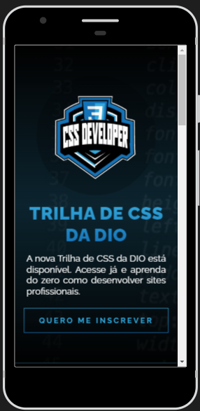
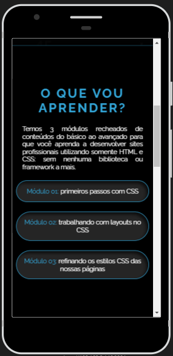

# Landing Page com HTML e CSS

## Objetivo deste Projeto:

> Ele foi criado como um desafio de projeto para o **Bootcamp Potência Tech iFood - Desenvolvimento de Jogos** da plataforma DIO.
> O foco é utilizar os aprendizados de Html e Css ensinados no Módulo.

## Contexto do desafio

> "Bem vindo(a) ao primeiro desafio da Trilha de CSS da DIO! Nela, você vai construir sua primeira Landing Page com HTML e CSS, colocando em prática os fundamentos do CSS, as propriedades básicas da linguagem de estilização, além de trabalhar com as unidades de medidas relativas e absolutas que aprendemos ao longo da trilha."

> O Html já existe no projeto: https://github.com/digitalinnovationone/trilha-css-desafio-01.

> O CSS deve ser feito de ocordo com um protótipo em Figma: https://www.figma.com/file/3PiokoJj9IhGDnNiWAJbz7/DIO---Desafio-01?type=design&node-id=2-6&mode=design.

## Proposta

> Explore todos os conceitos que aprendemos nessa imersão e replique ou melhore este projeto prático.

> Após realizada a atividade, percebi que não havia responsividade no código, por isso fiz uma melhoria criando a parte mobile em Css.

>  >  >  > 
